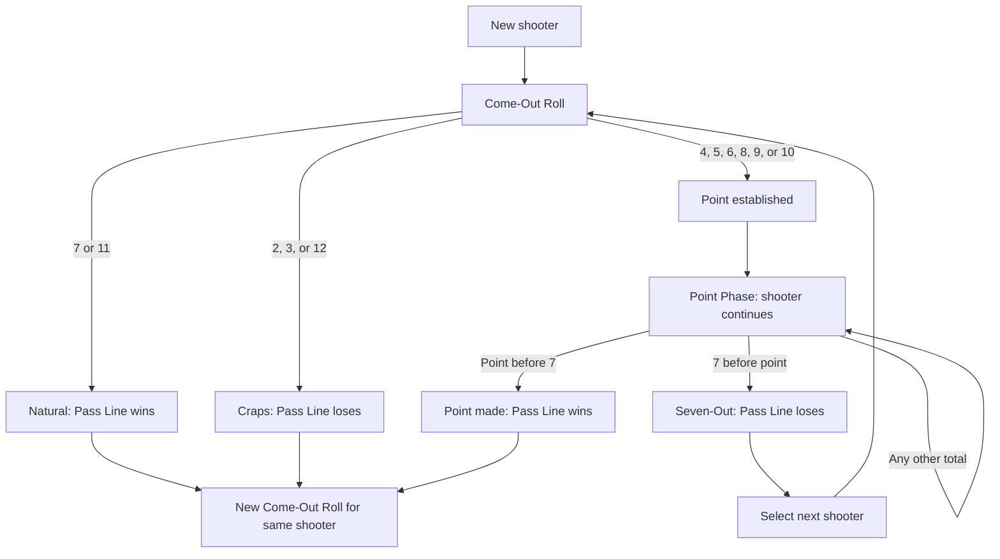

# Street Craps

Street Craps is a hardware-and-software craps game. The planned experience connects Arduino-controlled dice to a web application: an Arduino UNO R4 WiFi senses a physical shake, generates two digital die values, and sends the roll over Wi-Fi to a Node.js server. The server broadcasts rolls to a React frontend in real time.

This document explains standard casino craps rules and how the project intends to implement them. Casinos can vary some payouts and procedures; any such variation should be stated as a house rule. The initial game may implement a simplified subset of standard craps.

## How It Works

The intended architecture is:

```text
Physical Dice / Shake Sensor
          |
          v
Arduino UNO R4 WiFi
          |
        Wi-Fi
          |
          v
Node.js + Express
          |
      Socket.IO
          |
          v
React Frontend
```

When the physical shake input activates, the Arduino is intended to generate two values from 1 through 6 and send a JSON message such as:

```json
{
  "die1": 4,
  "die2": 2,
  "total": 6
}
```

The current Node server accepts this shape at `POST /api/roll`, validates that the dice values are valid and that their sum matches `total`, applies the Come-Out/Point and shooter rotation rules, and broadcasts a `dice-roll` Socket.IO event. The event includes the assigned shooter and outcome. The Arduino handles physical input, dice generation, and network communication rather than deciding game rules.

## Basic Craps Concepts

Craps uses two six-sided dice. Each **roll** throws both dice; the **total** is their sum, from 2 through 12.

| Term | Meaning |
| --- | --- |
| **Shooter** | The player currently rolling the dice. |
| **Dice** | Two six-sided dice. Each die has a value from 1 to 6. |
| **Roll** | One throw of both dice. The total is the sum of their faces. |
| **Come-Out Roll** | The first roll of a shooter's turn and the first roll after a point is made. It determines whether a point is established. |
| **Point** | A Come-Out total of 4, 5, 6, 8, 9, or 10. The shooter tries to roll that total again before rolling a 7. |
| **Point Phase** | The part of the round after a point is established and before the point or a 7 is rolled. |
| **Seven-Out** | A 7 rolled during the Point Phase, before the point. It ends the shooter's turn. |
| **Pass Line** | A main bet placed before a Come-Out Roll. It wins on a Come-Out 7 or 11, or when the point is rolled before a 7. |
| **Don't Pass** | A bet generally opposite to Pass Line. It wins on a Come-Out 2 or 3 (12 normally pushes), or when 7 rolls before the point. |
| **Come** | A Pass Line-style bet made after the table point has been established. It can establish its own separate Come Point. |
| **Don't Come** | The opposite-side version of Come. It can establish its own separate Don't Come Point and normally pushes on 12 on its initial roll. |
| **Place Bet** | A bet on 4, 5, 6, 8, 9, or 10 to roll before a 7. It can stay active over several rolls. |
| **Field Bet** | A one-roll bet on 2, 3, 4, 9, 10, 11, or 12. |
| **Bankroll** | A player's available money or chips for wagering. It changes as bets are made, returned, won, or lost. |

The totals 2, 3, 7, 11, and 12 have special names or significance. Their effect depends on the phase and bet:

| Total | Common name / significance |
| --- | --- |
| **2** | Often called **snake eyes**. It is craps for Pass Line on the Come-Out Roll; it wins Don't Pass and Field bets. |
| **3** | Craps for Pass Line on the Come-Out Roll; it wins Don't Pass and Field bets. |
| **7** | A **natural** on the Come-Out Roll, winning Pass Line and Come. During the Point Phase, a 7 before the point is a Seven-Out. |
| **11** | Often called **yo** or **yo-leven**. It is a Come-Out natural for Pass Line and Come; it loses Don't Pass and wins Field. |
| **12** | Often called **boxcars** or **midnight**. It is Come-Out craps for Pass Line; Don't Pass normally pushes, and Field commonly pays extra. |

## Come-Out Roll

Every new shooter's turn begins with a Come-Out Roll. After a point is made, the same shooter begins another Come-Out Roll; making the point does not end that shooter's turn.

The standard Pass Line results are:

| Come-Out total | Result for Pass Line | Result for Don't Pass |
| --- | --- | --- |
| 7 or 11 | Natural: wins | Loses |
| 2 or 3 | Craps: loses | Wins |
| 12 | Craps: loses | Normally pushes |
| 4, 5, 6, 8, 9, or 10 | That total is established as the point; enter the Point Phase | Same point is established |

A point is established when the Come-Out Roll is **4, 5, 6, 8, 9, or 10**. The shooter keeps rolling, and the game enters the Point Phase.

## Point Phase

Once the point is established, the shooter continues to roll:

- If the shooter rolls the point **before a 7**, the point is made. Pass Line wins, and that same shooter begins a new Come-Out Roll.
- If the shooter rolls a **7 before the point**, it is a Seven-Out. Pass Line loses, the shooter's turn ends, and a new shooter is selected.
- Any other total leaves the Pass Line bet unresolved; the shooter continues rolling.

A Come-Out 7 and a Point Phase 7 have different outcomes. The Come-Out 7 is a natural win for Pass Line; a 7 before the point during the Point Phase is a Seven-Out and loses Pass Line.

## Pass Line Bet

The Pass Line is usually placed before the Come-Out Roll. It is the basic bet that the shooter will make a natural or make the established point:

| Phase | Outcome |
| --- | --- |
| Come-Out: 7 or 11 | Wins |
| Come-Out: 2, 3, or 12 | Loses |
| Come-Out: 4, 5, 6, 8, 9, or 10 | Point established; bet stays active |
| Point Phase: point before 7 | Wins |
| Point Phase: 7 before point | Loses (Seven-Out) |

## Don't Pass Bet

The Don't Pass is generally the opposite side of Pass Line. On the Come-Out Roll, **2 or 3 wins**, **7 or 11 loses**, and **12 normally pushes** (the wager is returned). A 4, 5, 6, 8, 9, or 10 establishes the point and keeps the bet active.

During the Point Phase:

- A 7 before the point wins for Don't Pass.
- The point before a 7 loses for Don't Pass.

The Come-Out 12 push is the special exception to the otherwise opposite outcomes. Casinos may have house-rule variations, so the implementation should state which convention it uses.

## Place Bets

Place Bets are made on **4, 5, 6, 8, 9, or 10**. A Place Bet wins if its selected number is rolled before a 7. If 7 rolls first, the bet loses. Other totals do not resolve the bet, so it can remain active across multiple rolls while the shooter continues.

Common standard payouts are:

| Place number | Common payout |
| --- | --- |
| 4 or 10 | 9:5 |
| 5 or 9 | 7:5 |
| 6 or 8 | 7:6 |

Exact payouts and whether a Place Bet is working on a Come-Out Roll can vary by casino. A game should define its house convention rather than leave this ambiguous.

## Field Bet

The Field is a **one-roll** bet. It wins on **2, 3, 4, 9, 10, 11, or 12** and loses on **5, 6, 7, or 8**. The 2 and 12 commonly pay more than the other Field numbers, but the extra payout varies by casino.

## Come Bet

A Come bet is similar to a Pass Line bet but is made **after a table point has already been established**. The next roll resolves it immediately or establishes a separate Come Point:

| Next roll | Come result |
| --- | --- |
| 7 or 11 | Wins |
| 2, 3, or 12 | Loses |
| 4, 5, 6, 8, 9, or 10 | Establishes this bet's Come Point |

After a Come Point is established, that individual bet wins if its Come Point rolls before a 7 and loses if a 7 rolls first. Other totals leave it unresolved. A Come Point is tracked separately from the table's original point.

## Don't Come Bet

A Don't Come bet is the opposite-side version of Come, also made **after the table point has been established**:

| Next roll | Don't Come result |
| --- | --- |
| 2 or 3 | Wins |
| 12 | Normally pushes |
| 7 or 11 | Loses |
| 4, 5, 6, 8, 9, or 10 | Establishes this bet's Don't Come Point |

After a Don't Come Point is established, the bet wins if a 7 rolls before that point and loses if its point rolls first. Each Come or Don't Come point is tracked independently from the table point.

## Shooter Rules

The shooter is the player currently rolling. The shooter starts with a Come-Out Roll and continues rolling after a point is established. If the shooter makes the point, the same shooter begins another Come-Out Roll. If the shooter rolls a Seven-Out, their turn ends and the dice pass to the next shooter, who begins a new Come-Out Roll.

The initial Street Craps plan is a two-player rotation:

- Player 1 starts as shooter.
- When Player 1 Seven-Outs, Player 2 becomes shooter.
- When Player 2 Seven-Outs, Player 1 becomes shooter.

This describes the planned two-player implementation. The standard bet outcomes above remain the casino rules; the simplified player rotation is a project scope choice.

## Roll Examples

### Example 1: Come-Out natural

Come-Out Roll = **7**.

- The roll is a natural.
- Pass Line wins.
- A new Come-Out Roll follows for the same shooter.

### Example 2: Point made

Come-Out Roll = **5**.

- The point becomes 5 and the shooter enters the Point Phase.
- Next roll = **8**: the Pass Line bet is unresolved, so the shooter continues.
- Next roll = **5**: the point is made, Pass Line wins, and the same shooter begins a new Come-Out Roll.

### Example 3: Seven-Out

Come-Out Roll = **8**, establishing a point of 8. The next roll is **7**.

- This is a Seven-Out because it occurs during the Point Phase before the point.
- Pass Line loses and the shooter's turn ends.
- The next player becomes shooter.

## Street Craps Game State

To implement the game, the server will eventually need to track:

- Players and bankrolls.
- Current shooter and turn order.
- Current phase: Come-Out Roll or Point Phase.
- The current table point, if established.
- Both die values and their total.
- Active bets, bet owners, amounts, and each bet's point or status.
- Roll history.
- Winning, losing, and pushed bets, including payout and bankroll changes.

Come and Don't Come bets can have separate points while the table point remains active. The current server implements the main Come-Out/Point flow and two-player shooter rotation, but does not implement separate Come/Don't Come points, bet settlement, or bankroll updates.

## Planned Betting Features

**Planned** and **Future** indicate intended work, not implemented features.

| Feature | Description | Status |
| --- | --- | --- |
| Pass Line | Main Come-Out bet | Planned |
| Don't Pass | Opposite-side Come-Out bet, including the standard 12 push | Planned |
| Place Bets | Bets on 4, 5, 6, 8, 9, or 10 | Planned |
| Field | One-roll bet | Planned |
| Come | Pass-style bet after a table point is established | Planned |
| Don't Come | Don't Pass-style bet after a table point is established | Planned |
| Odds | Additional wager behind an established Pass Line or Come bet | Future / advanced |
| Proposition Bets | Specialty bets, commonly resolved on one roll or a specific combination | Future |

Odds bets are optional additional wagers behind an established Pass Line or Come bet. They pay true odds for the point number, subject to table limits and procedures. They are a future/advanced feature, not part of the initial simplified version.

The first playable version may implement a smaller standard subset, such as two alternating players, Come-Out and Point Phases, Pass Line outcomes, and roll history, before the other bets and procedures are added.

## Craps Game Flow

This diagram shows the main Pass Line round. Come and Don't Come bets have their own separate points while the table round continues.



For Don't Pass on the Come-Out Roll, 2 or 3 wins, 12 pushes, and 7 or 11 loses. During the Point Phase, 7 before the point wins and the point before 7 loses.

## Technology Stack

| Technology | Role |
| --- | --- |
| Arduino UNO R4 WiFi | Shake input, digital dice generation, and Wi-Fi communication |
| Wi-Fi | Sends the roll from Arduino to a server reachable on the network |
| C++ | Arduino firmware language |
| Node.js | Backend JavaScript runtime |
| Express | HTTP API for incoming Arduino rolls |
| Socket.IO | Real-time broadcasts to browser clients |
| React | Web game interface |
| Vite | Frontend development server and build tool |
| JavaScript | Backend and frontend language |
| REST API | HTTP interface for posting and retrieving rolls |
| JSON | Roll request and response data format |

## Current Functionality

- The Node.js/Express server listens on port `3000` on all network interfaces.
- `POST /api/roll` accepts `{ "die1": 4, "die2": 2, "total": 6 }`, validates the values, emits `dice-shake` for 900 ms, then applies the game rules, stores the roll, and broadcasts `dice-roll`.
- `GET /api/roll/latest` returns the latest accepted roll or `null` before the first roll.
- `GET /api/game` returns the current shooter, phase, point, last outcome, and roll history.
- The server accepts a `phone-roll` Socket.IO event with the same dice fields.
- The game implements Come-Out and Point phase outcomes, retains the shooter after a natural, craps result, or made point, and passes the shooter to the other player after a Seven-Out.
- The roll history stores each roll with its assigned player, phase, point, outcome, dice, and timestamp. The client displays the history and live point/shooter state.
- The root-level Arduino sketch detects a shake, generates dice values, and submits them over Wi-Fi. Bet settlement and bankroll updates are not yet implemented.

The server keeps game state and roll history in memory; both reset when it restarts. Bet placement, payout settlement, and bankroll updates remain unimplemented.

## Running the Current Server

From the project root, install the root dependencies and start the backend:

```bash
npm install
node Server.js
```

The Arduino must post to the server computer's LAN IP address, not `localhost`, for example `http://192.168.1.20:3000/api/roll`. The computer and Arduino must be able to reach one another on the network, and the computer's firewall may need to allow port `3000`.

Example HTTP request:

```http
POST /api/roll HTTP/1.1
Host: 192.168.1.20:3000
Content-Type: application/json

{"die1":4,"die2":2,"total":6}
```

To run the Vite client, use another terminal:

```bash
cd Client
npm install
npm run dev
```

The client connects to the backend at port `3000` on the browser's current
hostname by default. Set `VITE_SERVER_URL` before starting Vite if the backend
is hosted at another URL. The SerialPort packages present in the backend
dependencies are not used by this Wi-Fi HTTP path.

## Project Philosophy

The Arduino is responsible for physical dice input, generating two die values, and communicating the roll over Wi-Fi. The Node.js server owns the implemented craps round state and two-player shooter rotation so all clients see the same result. React displays the game state and provides the player interface. Socket.IO distributes dice rolls and game-state changes in real time.

The project can be built in stages: first make roll delivery reliable, then add a simplified standard craps ruleset, and finally add the broader range of bets and casino procedures. Planned features should remain clearly labeled until they are implemented.
